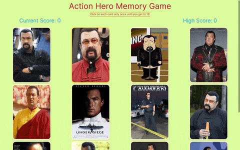

# Action Hero Memory Game

Test your memory with Action Hero Superstar Steven Seagal!

**Link to project:** <https://hddev8.github.io/memory-game/>

  

## How It's Made

**Tech used:** React, Vite, Tailwind CSS, HTML

Each card features action movie superstar / martial arts master Steven Seagal!

## Optimizations

In this game, you try to click on each card only once until you've clicked on all 12. With every click, the cards are shuffled, testing your memory. I'd like to add sound effects for each click, or one of Steven Seagal's songs to start playing as soon as the page loads. I'd like to add levels and improve the design, as well as streamline the use of Tailwind CSS.

## Lessons Learned

I'm learning React, which I'm enjoying. I'm learning how to use build tools such as Vite to create an app and deploy it. I also incorporated Tailwind CSS for the first time.

## Recent Projects

Phonebook: <https://fso-phonebook-app.onrender.com/>

Todo List: <https://hddev8.github.io/todo-list/>

Library Project: <https://hddev8.github.io/library-project/>

Tic Tac Toe: <https://hddev8.github.io/tic-tac-toe/>
